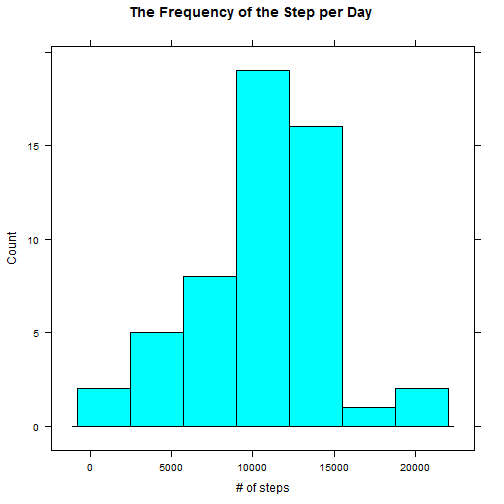
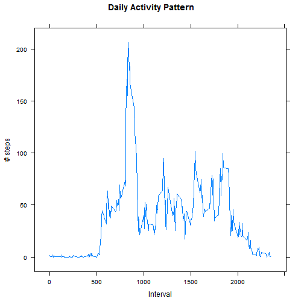
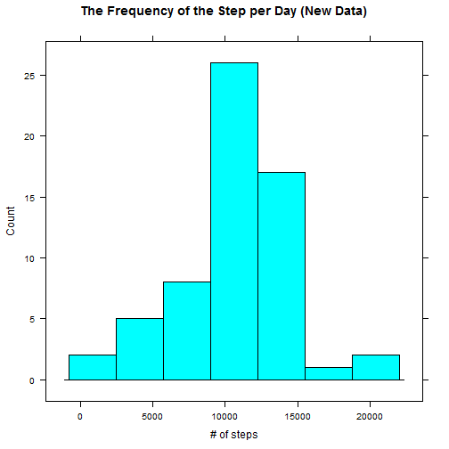
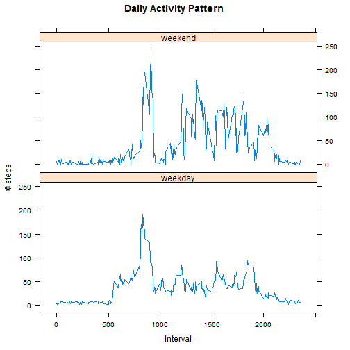

## Loading and preprocessing the data

The data set to be analyzed was obtained through the forked Github  repository.

The date of obtaining: Aug. 10, 2014

** Setting up the environment for the data analysis**

This is the working directory for the assignment.


```r
setwd("~/GitHub/RepData_PeerAssessment1")
```


```r
# Load the libraries that be of use
library(ggplot2)
library(lattice)
```

Load the data and take a look:


```r
activity <- read.table("Data/activity.csv", header =T, sep =",")


head(activity)
```

```
##   steps       date interval
## 1    NA 2012-10-01        0
## 2    NA 2012-10-01        5
## 3    NA 2012-10-01       10
## 4    NA 2012-10-01       15
## 5    NA 2012-10-01       20
## 6    NA 2012-10-01       25
```

```r
tail(activity)
```

```
##       steps       date interval
## 17563    NA 2012-11-30     2330
## 17564    NA 2012-11-30     2335
## 17565    NA 2012-11-30     2340
## 17566    NA 2012-11-30     2345
## 17567    NA 2012-11-30     2350
## 17568    NA 2012-11-30     2355
```

```r
str(activity)
```

```
## 'data.frame':	17568 obs. of  3 variables:
##  $ steps   : int  NA NA NA NA NA NA NA NA NA NA ...
##  $ date    : Factor w/ 61 levels "2012-10-01","2012-10-02",..: 1 1 1 1 1 1 1 1 1 1 ...
##  $ interval: int  0 5 10 15 20 25 30 35 40 45 ...
```

The data type of the date column is factor.  It needs to be changed to date type.


```r
activity$date <- as.Date(activity$date)
```

For now, remove all the rows with NA values.


```r
no.NA.activity <- activity[complete.cases(activity),]
```

## What is mean total number of steps taken per day?

In this section of the analysis, **NA values in the original dataset are ignored.**

Aggregate the step per day, then draw a histogram of # of steps per day.


```r
steps.per.day <- aggregate(no.NA.activity$steps, by = list(no.NA.activity$date), FUN="sum")

# Plotting a histogram
histogram(~x, data=steps.per.day, type="count", main="The Frequency of the Step per Day", xlab="# of steps")
```

 

Calculating the mean and median steps per day.


```r
mean.steps <- mean(steps.per.day$x)
median.steps <- median(steps.per.day$x)
```

The mean is 'r mean.steps' and the median is 'r median.steps'.


## What is the average daily activity pattern?

To answer this question, mean # of steps taken in each time interval needs to be calculated, again **NA values are ignored.**  


```r
# Aggegate the dataset to get the mean values
mean.steps.time <- aggregate(no.NA.activity$steps, by =list(no.NA.activity$interval), FUN="mean")

# A time series plot
xyplot(x~Group.1, data=mean.steps.time, t="l", main="Daily Activity Pattern", xlab ="Interval", ylab="# steps")
```

 

Which 5-minute interval, on average across all the days in the dataset, contains the maximum number of steps?


```r
max.day <- max(mean.steps.time$x)
max.steps.itv <- mean.steps.time[which.max(mean.steps.time$x),c("Group.1")]
```

The maximum nember of steps, 'r max.day', are taken during the interval of 'r max.steps.itv'.


## Imputing missing values

The number of the rows with NA values can be calculated by subtracting the number of the row without NA values from the total number of rows in the data frame.

The number of complete cases have been calculated using complete.case function earlier and stored in no.NA.activity variable.

Therefore, the number of the rows with NA values can be calculated as such:


```r
num.NA <- nrow(activity) - nrow(no.NA.activity)
```

There are 'r num.NA' rows with NA values.

**Substituting values for NAs**

It may not be a godd idea to simply ignore NA values.  There may be a need to substitute a plausible value for an NA.

Here, I randomly select one of the mean values for time intervals calculated earlier and substitute it for an NA.


```r
# Create a new dataset with generated values 

activity2 <- activity
for (i in 1:dim(activity2)[1]) {
        if (is.na(activity2[i,1])) {
                activity2[i,1] <- sample(mean.steps.time[, 2], 1)
        }
}
```

Let's make a histogram of the total number of steps taken per day, with the new dataset.


```r
# Calculate the total # of steps per day
steps.per.day2 <- aggregate(activity2$steps, by = list(activity2$date), FUN="sum")

# Plotting a histogram
histogram(~x, data=steps.per.day2, type="count", main="The Frequency of the Step per Day", xlab="# of steps")
```

 

The mean and median steps per day, with the new datasat.


```r
mean.steps2 <- mean(steps.per.day2$x)
median.steps2 <- median(steps.per.day2$x)
```

The mean is 'r mean.steps2' and the median is 'r median.steps2'.  The general pattern remain the same.  The mean and the median value are similar, the median being slightly lower than the mean.  The new histogram shows more prominant peak around the interval of 10000, but the trend is still there. The generated values did not change the nature of the dataset.


## Are there differences in activity patterns between weekdays and weekends?

Add a column weekday to the new dataset.


```r
for (i in 1:dim(activity2)[1]) {
        if (weekdays(activity2$date[i]) == "Sanday" | weekdays(activity2$date[i]) == "Saturday") {
                activity2$weekDay[i] <- "weekend"    
        }
          else activity2$weekDay[i] <- "weekday" 
}

activity2$weekDay <- as.factor(activity2$weekDay)
```


```r
# Aggregate by Interval and the weekday/weekend
mean.steps.time2 <- aggregate(activity2$steps, by =list(activity2$interval, activity2$weekDay), FUN="mean")

# Plotting
xyplot(x~Group.1 | Group.2, data=mean.steps.time2, t="l", layout = c(1,2), main="Daily Activity Pattern", xlab ="Interval", ylab="# steps")
```

 

It seems that more steps taken during weekend than weekdays, although, people are starting the avtivities later in the course of the day on weekends, which seems to make sense. The overall trend resembles one another, having a peak in the earlier part of the day and somewhat activy throughout the later half.
